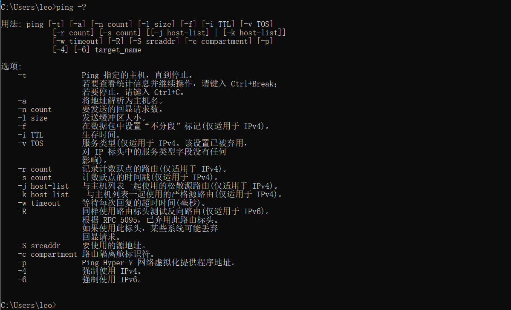
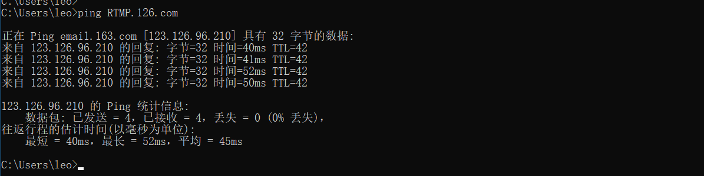
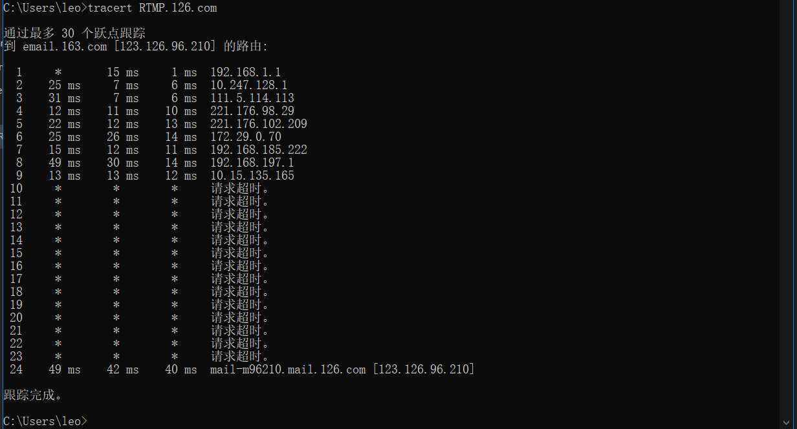

## 1、ping  

* ping 介绍  
  
    ping用于确定本地主机是否能与另一台主机成功交换(发送与接收)数据包，再根据返回的信息，就可以推断TCP/IP参数是否设置正确，以及运行是否正常、网络是否通畅等。Ping命令可以进行以下操作:  
     - 通过将ICMP(Internet控制消息协议)回显数据包发送到计算机并侦听回显回复数据包来验证与一台或多台远程计算机的连接。  
     - 每个发送的数据包最多等待一秒。  
     - 打印已传输和接收的数据包数。  
  
* ping 命令使用方式（windows下）  

   

* ping通 命令运行截图  

   

* ping不通 命令运行截图  

   

## 2、tracert  

* tracert 介绍  
  
    Tracert（跟踪路由）是路由跟踪实用程序，用于确定 IP 数据包访问目标所采取的路径。Tracert 命令用 IP 生存时间 (TTL) 字段和 ICMP 错误消息来确定从一个主机到网络上其他主机的路由。  
  
* tracert 命令使用方式（windows下）  

   

* tracert 命令截图  

   
