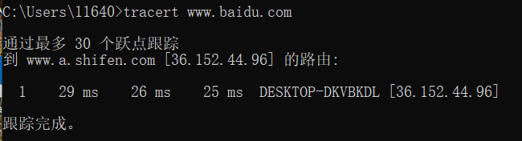

# 陈俊杰的第一次计网作业

* ping一台计算机

  * 指令: `ping www.bing.com`

  

* tracert一个服务器

  * 代码: `tracert www.baidu.com`

  

  

  ## 总结

  >> Tracert（跟踪路由）是[路由跟踪](https://baike.baidu.com/item/路由跟踪/8935428)实用程序，用于确定 IP 数据包访问目标所采取的路径。Tracert 命令用 IP 生存时间 (TTL) 字段和 ICMP 错误消息来确定从一个[主机](https://baike.baidu.com/item/主机/455151)到网络上其他主机的路由。
  >
  >> PING （Packet Internet Groper），[因特网](https://baike.baidu.com/item/因特网/114119)包探索器，用于测试网络连接量的程序 [1] 。Ping是工作在 [TCP/IP](https://baike.baidu.com/item/TCP%2FIP/214077)网络体系结构中应用层的一个服务命令， 主要是向特定的目的主机发送 [ICMP](https://baike.baidu.com/item/ICMP/572452)（Internet Control Message Protocol 因特网报文控制协议）[Echo](https://baike.baidu.com/item/Echo/35157) 请求报文，测试目的站是否可达及了解其有关状态 [2] 。

  