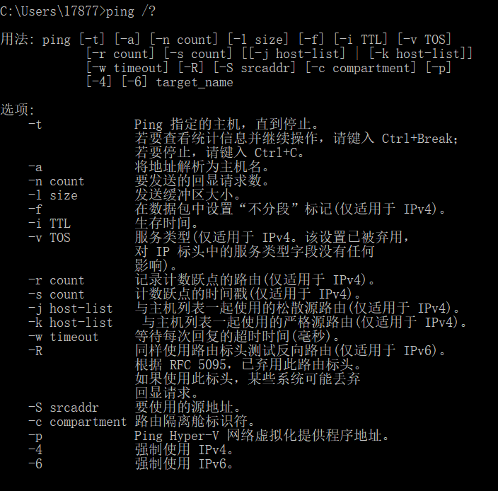
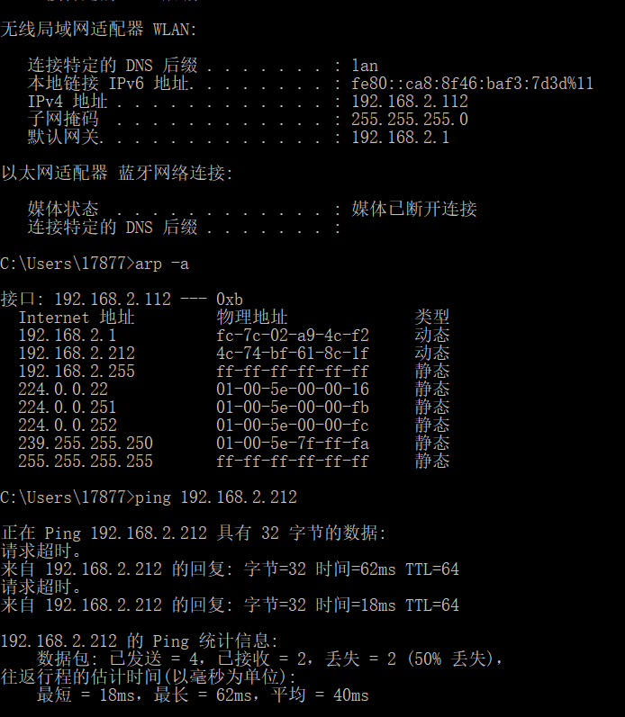
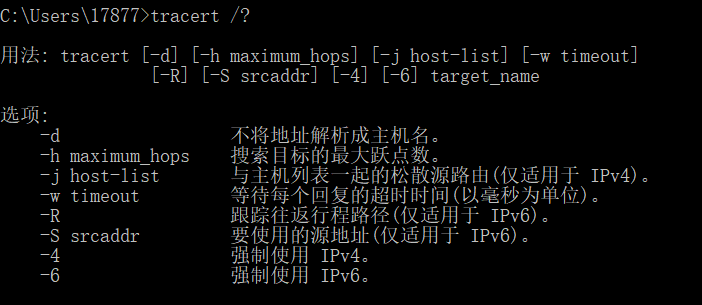
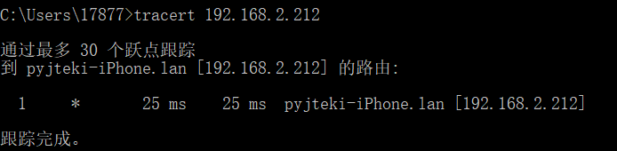

> # PING
>PING （Packet Internet Groper），因特网包探索器，用于测试网络连接量的程序  。Ping是工作
>在 TCP/IP网络体系结构中应用层的一个服务命令， 主要是向特定的目的主机发送 ICMP（Internet
> Control Message Protocol 因特网报文控制协议）Echo 请求报文，测试目的站是否可达及了解其
>有关状态
>
>1. 首先在命令行中输入ping /？来查询相关用法
>
>
>
>2. 本次作业中将位于同一局域网络下的手机作为所测试的目的主机，先通过arp -a命令查询出当前局域网下所有设备ip，查找出目的主机手机的ip为192.168.2.212。
>
>【注：由于手机所处位置网络信号问题，导致丢包】
---
> # TRACERT
>Tracert（跟踪路由）是路由跟踪实用程序，用于确定 IP 数据包访问目标所采取的路径。Tracert 命
>令用 IP 生存时间 (TTL) 字段和 ICMP 错误消息来确定从一个主机到网络上其他主机的路由。
>
>
>1. 首先在命令行中输入ping /？来查询相关用法
>
>
>
>2. 本次作业中将位于同一局域网络下的手机作为所测试的目的主机。
>
>【注：手机与电脑处在同一局域网下，因此在该路径上只有一个路由】