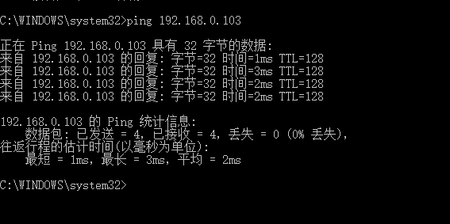
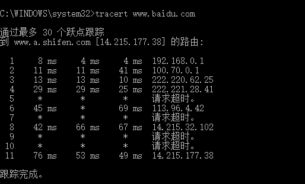

# 1. Ping

ping用于确定本地主机是否能与另一台主机成功交换(发送与接收)数据包，再根据返回的信息，就可以推断TCP/IP参数是否设置正确，以及运行是否正常、网络是否通畅等。

正常情况下，当你使用Ping命令来查找问题所在或检验网络运行情况时，你需要使用许多Ping命令，如果所有都运行正确，你就可以相信基本的连通性和配置参数没有问题；如果某些Ping命令出现运行故障，它也可以指明到何处去查找问题  。

Ping命令可以进行以下操作  :

①通过将ICMP(Internet控制消息协议)回显数据包发送到计算机并侦听回显回复数据包来验证与一台或多台远程计算机的连接。

②每个发送的数据包最多等待一秒。

③打印已传输和接收的数据包数。

#### Ping另一台计算机

​    在cmd执行如下指令:

   `ping 192.168.0.103`

# 2. Tracert

Tracert（跟踪路由）是路由跟踪实用程序，用于确定 IP 数据包访问目标所采取的路径。Tracert 命令用 IP 生存时间 (TTL) 字段和 ICMP 错误消息来确定从一个主机到网络上其他主机的路由。

#### 工作原理

通过向目标发送不同IP生存时间 (TTL) 值的“Internet控制消息协议 ICMP)”回应数据包，Tracert诊断程序确定到目标所采取的路由。要求路径上的每个路由器在转发数据包之前至少将数据包上的 TTL 递减 1。数据包上的 TTL 减为 0 时，路由器应该将“ICMP 已超时”的消息发回源系统。

Tracert 先发送 TTL 为 1 的回应数据包，并在随后的每次发送过程将TTL递增 1，直到目标响应或 TTL 达到最大值，从而确定路由。通过检查中间路由器发回的“ICMP 已超时”的消息确定路由。某些路由器不经询问直接丢弃 TTL 过期的数据包，这在 Tracert 实用程序中看不到。

#### Tracert百度的服务器

  在cmd执行如下指令：

 `tracert www.baidu.cn`

