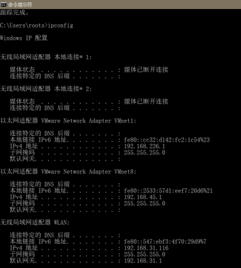
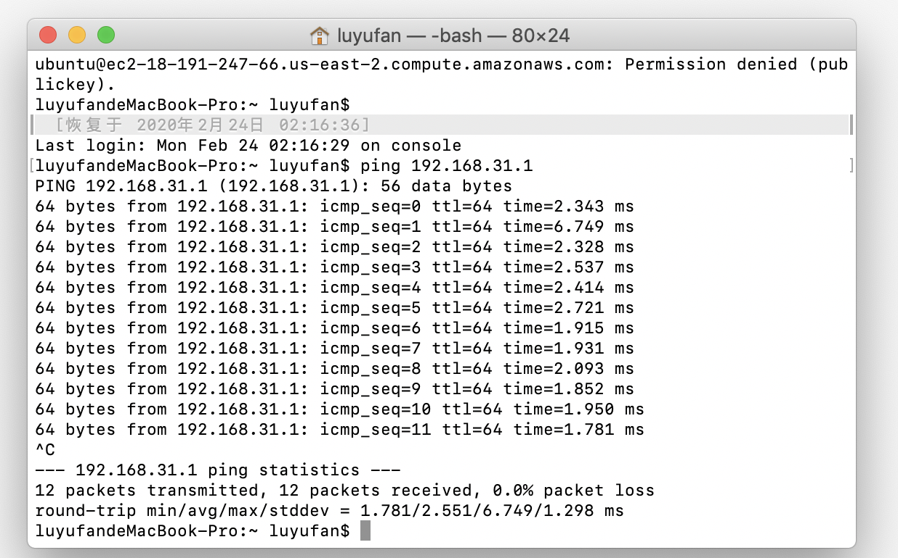
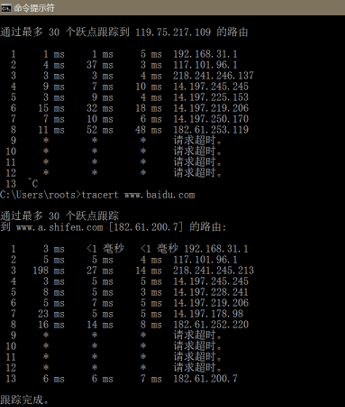

# 第一次作业
2017302580289/卢羽帆

------

## 1. ping另一台计算机

> * Ping是工作在TCP/IP网络体系结构中应用层的一个服务命令，主要是向特定目的主机发送ICMP Echo请求报文，测试目的站是否可达及了解其有关状态。

首先cmd进入终端，输入ipconfig查看电脑的IP地址，这里是192.168.31.116

在另一台电脑打开终端，输入ping 192.168.31.116

## 2. tracert服务器
> * Tracert是路由跟踪实用程序，用于确定 IP 数据包访问目标所采取的路径。Tracert 命令用 IP 生存时间 (TTL) 字段和 ICMP 错误消息来确定从一个主机到网络上其他主机的路由。

在终端输入tracert命令，这里用百度服务器，DNS解析自动将其转换为IP地址并探查出途经的路由器信息。
